# Self-hosted LLM

Deploy a self-hosted Large Language Model (LLM) using [Ollama](https://ollama.com/) and [Open WebUI](https://openwebui.com/).

Currently using the following models:

- [Llama 3.3 70b](https://ollama.com/library/llama3.3)
- [DeepSeek-R1 70b](https://ollama.com/library/deepseek-r1:70b)

## Architecture

```mermaid
architecture-beta
    group aws(logos:aws)[AWS Cloud]
    service ec2(logos:aws-ec2)[Ubuntu EC2 Instance] in aws
    service ebs(disk)[Block storage volume for data persistence] in aws
    service nvidia_gpu(logos:nvidia)[GPU Acceleration] in aws

    group containers(logos:docker)[Docker Compose]
    service ollama(logos:docker)[Ollama] in containers
    service webui(logos:docker)[Open WebUI] in containers

    ec2:L -- R:ollama
    ec2:L -- R:webui
    ec2:L -- R:ebs
    ec2:L -- R:nvidia_gpu
```



The LLM is deployed on an AWS EC2 instance with a pre-configured Amazon Machine Image (AMI) that includes Docker, the NVIDIA driver, and the NVIDIA Container Toolkit. The EC2 instance is equipped with four [NVIDIA L40S Tensor Core GPUs](https://www.nvidia.com/en-us/data-center/l40s/).

Docker Compose is used to manage two containers:

- Ollama: serves the model via an HTTP API on port 11434.
- Open WebUI: serves the user interface and interacts with Ollama for generating responses. The interface is exposed on port 8080.

An EBS volume is mounted to the EC2 instance to persist chat history, models, Docker data, etc.

## Deploy

```shell
aws sso login
```

```shell
./deploy.sh
```

## Teardown

```shell
terraform destroy --auto-approve
```
